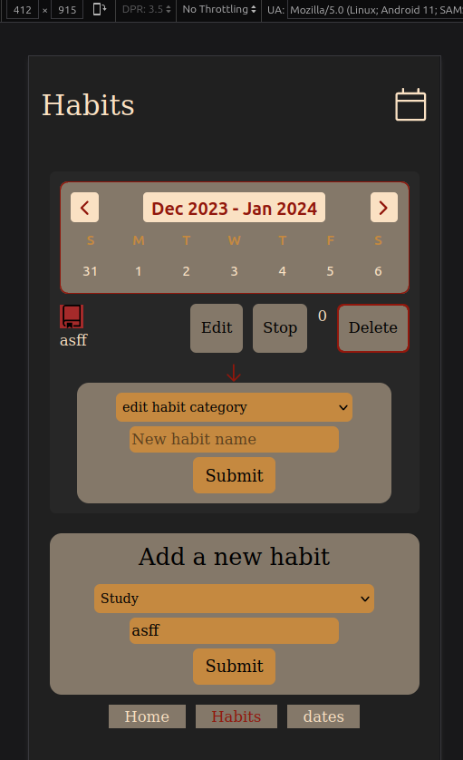

# habit-tracking-app

This Habit-Tracking Web Application is designed to help users maintain and track daily habits like exercising, reading, or meditating. Developed using Vue.js and other modern web technologies, the app provides an intuitive and user-friendly platform for habit management.

## Table of contents

- [Overview](#overview)
  - [Key Features](#key-features)
  - [Technologies Used](#technologies-used)
  - [Screenshots](#screenshots)
- [Setup and Installation](#setup-and-installation)
  - [Compile and Hot-Reload for Development](#Compile-and-Hot-Reload-for-Development)
  - [Type-Check, Compile and Minify for Production](#Type-Check,-Compile-and-Minify-for-Production)
  - [Run End-to-End Tests with](#Run-End-to-End-Tests-with)
  - [Lint](#Lint)

## Overview

### Key Features

- **Day Navigation:** Allows users to navigate between days to track habit completions, with a focus on past seven days.
- **Habit List:** Displays daily habits with functionalities to mark or unmark as completed.
- **Dynamic URL Routing:** URL changes with navigation, enabling direct access to specific dates.
- **Habit Management:** Features include adding, editing, stopping, and deleting habits.
- **Habit Streaks:** Encourages users with a display of habit completion streaks.
- **Habit Categories:** Organizes habits into customizable categories like Health, Work, Hobbies, etc.
- **User Onboarding:** Provides a guided introduction to new users for app functionalities.
- **Responsive Design:** Ensures a seamless experience across mobile, tablet, and desktop resolutions.

### Technologies Used

- **Frontend:** Vue.js (Vue 3 with Composition API)
- **Routing:** Vue Router
- **Data Persistence:** localStorage
- **Styling:** Custom CSS 
- **Code Quality:** ESLint, Prettier, Stylelint
- **Build Tool:** Vite

### Screenshot




## Setup and Installation

```sh
npm install
```

### Compile and Hot-Reload for Development

```sh
npm run dev
```

### Type-Check, Compile and Minify for Production

```sh
npm run build
```

### Lint with ESLint

```sh
npm run lint
```
